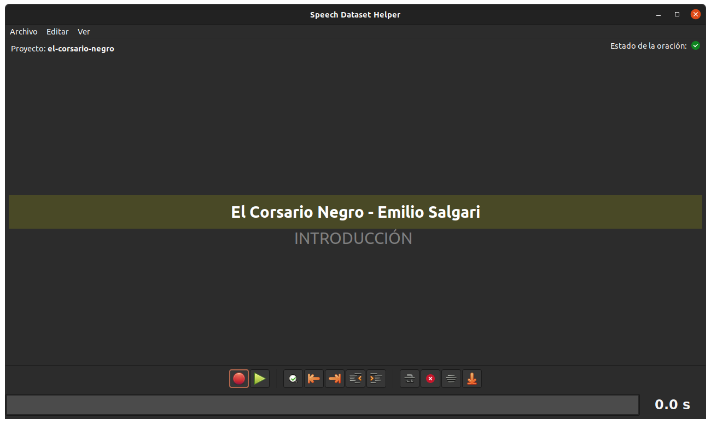

This is a Python/Gtk application that helps you in the task of recording and
annotating audio clips to generate a speech dataset used to train TTS models.

It uses the same format as LJ-Speech dataset, from Keith Ito and Linda Johnson.
It also trims and denoises the clips, auto-normalize labels and some other
minor tasks.

Btw, this is provided as-is. I made it for fun, and also to help me in other
projects. You can use it, if you want. This code is under GPLv3.

To run this application, first install its depends (listed on DEPENDS file).
On Debian and derived, you can run:

    make install-depends

Then, to launch, just run:

    ./sdh.py

Here is a screenshot:

# References

* https://keithito.com/LJ-Speech-Dataset/

# Other handy recipes

* CLI Denoise: https://unix.stackexchange.com/a/427343/229516
    - cut a noise sample with audacity
    - sox noise.wav -n noiseprof noise_profile
    - sox source.mp3 output.mp3 noisered noise_profile 0.31

* CLI Trim silence: https://stackoverflow.com/a/72426502/870503
    - sox source.wav output.wav silence 1 0.1 0.8% reverse silence 1 0.1 0.8% reverse
